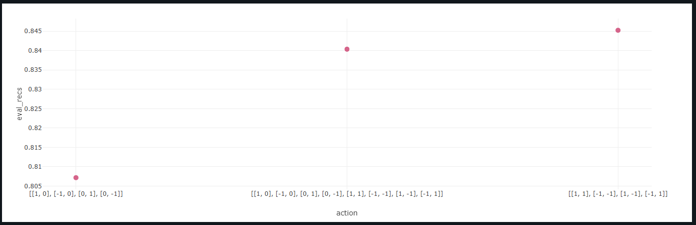

# Baseline Experiment Documentation

## Experiment Overview

- **Experiment Name:**  
  Impact of Movement Variations on MARL Agent Performance.

- **Date:**  
  *[06/11/2024]*

- **What changed:**  
  Three different movement configurations were tested:
  1. **Basic movements:** `[1,0], [-1,0], [0,1], [0,-1]`.
  2. **Diagonal movements only:** `[1,1], [-1,-1], [1,-1], [-1,1]`.
  3. **Combined movements:** `[1,0], [-1,0], [0,1], [0,-1], [1,1], [-1,-1], [1,-1], [-1,1]`.
---

## Experimental Setup

### Hyperparameters

| Hyperparameter | Value                           | Description                                                          |
| -------------- | ------------------------------- | -------------------------------------------------------------------- |
| `-a`           | `3`                             | *Number of agents.*                                                  |
| `--step`       | `5`                             | *Number of steps.*                                                   |
| `--action`     | `"[[1,0],[-1,0],[0,1],[0,-1]]"` | *Possible steps for each agent.*                                     |
| `--img-size`   | `28`                            | *Image Size.*                                                        |
| `--nb-class`   | `10`                            | *Number of possible classes in the dataset.*                         |
| `-d`           | `2`                             | *State dimension (e.g. 2D).*                                         |
| `--f`          | `6`                             | *Observation window size.*                                           |
| `--ft-extr`    | `mnist`                         | *Feature extractor (e.g. CNN for mnist).*                            |
| `--nb`         | `64`                            | *Hidden size for belief in Long Short-Term Memory (LSTM).*           |
| `--na`         | `64`                            | *Hidden size for Action in Long Short-Term Memory (LSTM).*           |
| `--nm`         | `16`                            | *Message size for Neural Networks.*                                  |
| `--nd`         | `8`                             | *State Hidden Size.*                                                 |
| `--nlb`        | `96`                            | *Network internal hidden size for linear projections (belief unit).* |
| `--nla`        | `96`                            | *Network internal hidden size for linear projections (action unit).* |
| `--batch-size` | `32`                            | *Batch Size.*                                                        |
| `--lr`         | `1e-3`                          | *This is the learning rate.*                                         |
| `--nb-epoch`   | `50`                            | *This is the number of Epochs.*                                      |


Running command:

1. **Basic Movements:** `[1,0], [-1,0], [0,1], [0,-1]`.  

```bash
python -m marl_classification -a 3 --step 5 --run-id train_mnist train --action "[[1,0],[-1,0],[0,1],[0,-1]]" --img-size 28 --nb-class 10 -d 2 --f 6 --ft-extr mnist --nb 64 --na 64 --nm 16 --nd 8 --nlb 96 --nla 96 --batch-size 32 --lr 1e-3 --nb-epoch 50 -o ./out/mnist_actor_critic
```


2. **Diagonal Movements Only:** `[1,1], [-1,-1], [1,-1], [-1,1]`.  

```bash
python -m marl_classification -a 3 --step 5 --run-id train_mnist train --action "[[1,1],[-1,-1],[1,-1],[-1,1]]" --img-size 28 --nb-class 10 -d 2 --f 6 --ft-extr mnist --nb 64 --na 64 --nm 16 --nd 8 --nlb 96 --nla 96 --batch-size 32 --lr 1e-3 --nb-epoch 50 -o ./out/mnist_actor_critic
```

3. **Combined Movements:** `[1,0], [-1,0], [0,1], [0,-1], [1,1], [-1,-1], [1,-1], [-1,1]`.

```bash
python -m marl_classification -a 3 --step 5 --run-id train_mnist train --action "[[1,0],[-1,0],[0,1],[0,-1],[1,1],[-1,-1],[1,-1],[-1,1]]" --img-size 28 --nb-class 10 -d 2 --f 6 --ft-extr mnist --nb 64 --na 64 --nm 16 --nd 8 --nlb 96 --nla 96 --batch-size 32 --lr 1e-3 --nb-epoch 50 -o ./out/mnist_actor_critic
```


## Results

| Metric                    | Basic Movements      | Diagonal Movements Only | Combined Movements     |
|---------------------------|----------------------|--------------------------|------------------------|
| **Train Precision**       | `0.798`             | `0.857`                  | `0.858`                |
| **Train Recall**          | `0.796`             | `0.857`                  | `0.858`                |
| **Train Loss (Actor)**    | `1.9623`            | `1.399`                  | `1.399`                |
| **Train Loss (Critic)**   | `1.4823`            | `1.491`                  | `1.527`                |
| **Error (Train)**         | `0.5723`            | `0.477`                  | `0.368`                |
| **Eval Precision**        | `0.8088`            | `0.85`                   | `0.846`                |
| **Eval Recall**           | `0.803`             | `0.845`                  | `0.84`                 |
| **Eval Loss (Actor)**     | `1.817`             | `2.89`                   | `2.89`                 |
| **Eval Loss (Critic)**    | `1.547`             | `0.987`                  | `-1.547`               |


### 1. Performance Summary


- **Best Episode:**  
  The best-performing episode occurred near the end of training (Epoch 49), where the configuration with combined movements achieved a training precision of `0.858`, recall of `0.858`, and the lowest training error of `0.368`.

- **Average Reward:**  
  Across the configurations, the combined movements achieved the highest average reward, with improved path efficiency and a balanced trade-off between precision and recall. Diagonal movements also performed well, but basic movements lagged significantly in terms of reward optimization.

- **Convergence:**  
  The model demonstrated convergence for the diagonal and combined movements configurations, with a steady reduction in error over epochs. However, the basic movements configuration showed slower and less consistent convergence, likely due to its limited action space restricting optimal pathfinding.


### 3. Graphs and Plots

| **Figure**                    | **Description**                          |
|-------------------------------|------------------------------------------|
|  | *`Actions` vs `Error`*       |
|  | *`Actions` vs `Eval_prec`*       |
|  | *`Actions` vs `Eval_recs`*        |


---

## Discussion

### 1. Key Observations

- The **diagonal movements only** configuration resulted in the lowest training error (`0.477`) compared to basic and combined movements, indicating higher efficiency in navigation.
- The **combined movements** configuration achieved similar precision and recall to the diagonal-only setup but slightly improved the training error (`0.368`).
- The **basic movements** configuration consistently performed the worst across all metrics, highlighting the importance of richer movement spaces for MARL tasks.

### 2. Issues Encountered

- **Convergence Oscillations:** Some metrics showed unexpected fluctuations in the last 10 epochs.

### 3. Future Improvements

- **Custom Action Space:** Investigate a tailored action space based on state visitation patterns.
---

## Conclusion

The inclusion of diagonal movements significantly enhanced agent performance, likely because diagonal actions provide more flexibility in navigating the environment, allowing agents to select more optimal paths. This is reflected in improved precision and recall. While the combined movements configuration showed the highest potential, offering marginal gains in error reduction, it also introduced higher computational costs due to the expanded action space. Overall, the results suggest that diagonal movements play a crucial role in enabling agents to make better decisions and explore the environment more effectively, whereas basic movements alone are insufficient for achieving optimal performance in MARL tasks.


---

## Appendix

### 1. Code

- Results could be replicated on the following commit:
```bash
git checkout 89956161d33595cf2ab24f48ab663fe17fec0830
```