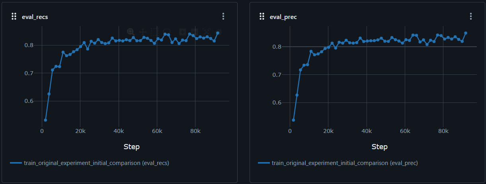

# MARL Experiment Documentation

## Experiment Overview

- **Base vs Original Experiment:**  
  *Test the difference between the Base and Original implementations.*

- **Date:**  
  *[05/11/2024]*

- **What changed from Base Experiment:**
  *The main difference lays on the communication module that is fully implemented on the second. No other parameters were changed.*

---

## Experimental Setup

### 1. Hyperparameters

| Hyperparameter | Value                           | Description                                                          |
| -------------- | ------------------------------- | -------------------------------------------------------------------- |
| `-a`           | `3`                             | *Number of agents.*                                                  |
| `--step`       | `5`                             | *Number of steps.*                                                   |
| `--action`     | `"[[1,0],[-1,0],[0,1],[0,-1]]"` | *Possible steps for each agent.*                                     |
| `--img-size`   | `28`                            | *Image Size.*                                                        |
| `--nb-class`   | `10`                            | *Number of possible classes in the dataset.*                         |
| `-d`           | `2`                             | *State dimension (e.g. 2D).*                                         |
| `--f`          | `6`                             | *Observation window size.*                                           |
| `--ft-extr`    | `mnist`                         | *Feature extractor (e.g. CNN for mnist).*                            |
| `--nb`         | `64`                            | *Hidden size for belief in Long Short-Term Memory (LSTM).*           |
| `--na`         | `64`                            | *Hidden size for Action in Long Short-Term Memory (LSTM).*           |
| `--nm`         | `16`                            | *Message size for Neural Networks.*                                  |
| `--nd`         | `8`                             | *State Hidden Size.*                                                 |
| `--nlb`        | `96`                            | *Network internal hidden size for linear projections (belief unit).* |
| `--nla`        | `96`                            | *Network internal hidden size for linear projections (action unit).* |
| `--batch-size` | `32`                            | *Batch Size.*                                                        |
| `--lr`         | `1e-3`                          | *This is the learning rate.*                                         |
| `--nb-epoch`   | `50`                            | *This is the number of Epochs.*                                      |

Running command:
```bash
python -m marl_classification -a 3 --step 5 --run-id original_experiment_initial_comparison train --action "[[1,0],[-1,0],[0,1],[0,-1]]" --img-size 28 --nb-class 10 -d 2 --f 6 --ft-extr mnist --nb 64 --na 64 --nm 16 --nd 8 --nlb 96 --nla 96 --batch-size 32 --lr 1e-3 --nb-epoch 50 -o ./out/mnist_actor_critic
```

---

## Results

```bash
Epoch 49 - Train, train_prec = 0.835, train_rec = 0.834, c_loss = 1.412, a_loss = 0.8665, error = 0.3200, path = -0.7344:
Epoch 49 - Eval, eval_prec = 0.8487, eval_rec = 0.8443
```

### 3. Graphs and Plots



---

## Discussion

### 1. Key Observations

- *Slight improvement from the base_experiment when the last values are compared (although they are not the best on the base_experiment). Overall, the evaluation curves are similar with no improvement.*

### 2. Issues Encountered

- *None*

### 3. Future Improvements

- *From this model on, new parameters must be tested.*

---

## Conclusion

- *Besides not showing many improvements, this model represents a more faithful representation of the original article and therefore must be considered the main model.*

---