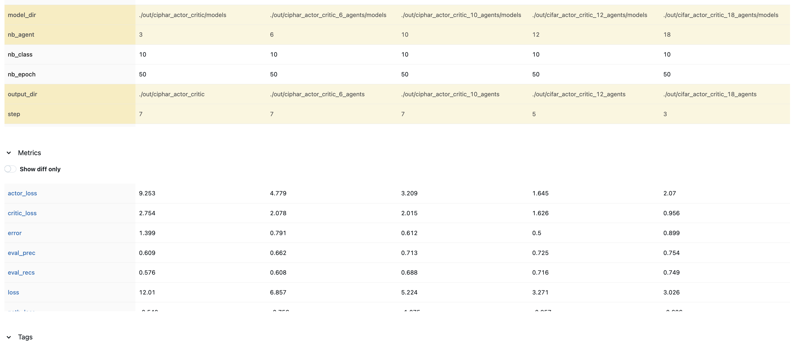
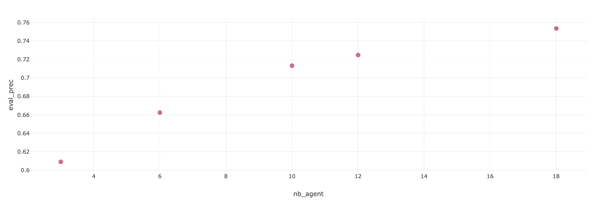
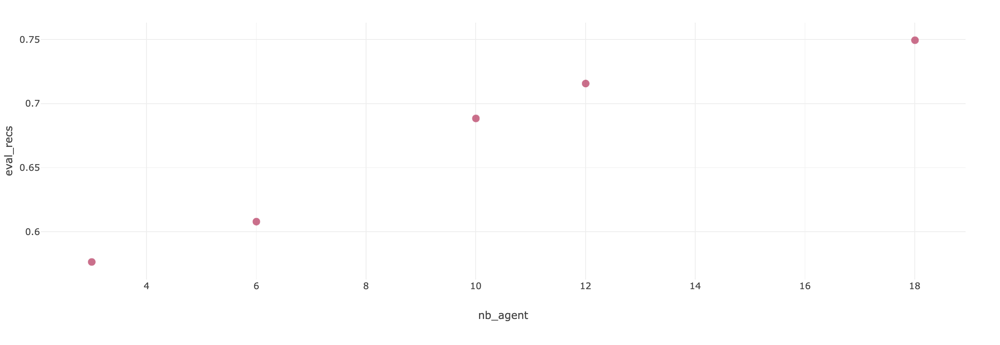

# MARL Experiment Documentation

## Experiment Overview

- **Cifar 10 Experiment:**  
  This experiment aims to train a Multi-Agent Reinforcement Learning (MARL) model on the Cifar 10 dataset. 


- **Date:**  
  *28/11/2024*

- **What changed from Base Experiment:**
  - This experiment uses the Cifar 10 dataset instead of the MNIST dataset.
  - Within this experiment, we did run the training 5 times with different number of agents and steps.
    - First run: 3 agents and 7 steps.
    - Second run: 6 agents and 7 steps.
    - Third run: 10 agents and 7 steps.
    - Fourth run: 12 agents and 5 steps.
    - Fifth run: 18 agents and 3 steps.

---

## Experimental Setup

### 1. Hyperparameters

| Hyperparameter | Value                           | Description                                                          |
| -------------- | ------------------------------- | -------------------------------------------------------------------- |
| `-a`           | `3`                             | *Number of agents.*                                                  |
| `--step`       | `5`                             | *Number of steps.*                                                   |
| `--action`     | `"[[1,0],[-1,0],[0,1],[0,-1]]"` | *Possible steps for each agent.*                                     |
| `--img-size`   | `28`                            | *Image Size.*                                                        |
| `--nb-class`   | `10`                            | *Number of possible classes in the dataset.*                         |
| `-d`           | `2`                             | *State dimension (e.g. 2D).*                                         |
| `--f`          | `6`                             | *Observation window size.*                                           |
| `--ft-extr`    | `mnist`                         | *Feature extractor (e.g. CNN for mnist).*                            |
| `--nb`         | `64`                            | *Hidden size for belief in Long Short-Term Memory (LSTM).*           |
| `--na`         | `64`                            | *Hidden size for Action in Long Short-Term Memory (LSTM).*           |
| `--nm`         | `16`                            | *Message size for Neural Networks.*                                  |
| `--nd`         | `8`                             | *State Hidden Size.*                                                 |
| `--nlb`        | `96`                            | *Network internal hidden size for linear projections (belief unit).* |
| `--nla`        | `96`                            | *Network internal hidden size for linear projections (action unit).* |
| `--batch-size` | `32`                            | *Batch Size.*                                                        |
| `--lr`         | `1e-3`                          | *This is the learning rate.*                                         |
| `--nb-epoch`   | `50`                            | *This is the number of Epochs.*                                      |

Running command:
for 3 agents
```bash
# add running command here
python -m marl_classification -a 3 --step 7 --run-id train_cifar_10__3_agents__7_steps train --action "[[1,1],[-1,-1],[-1,1],[1,-1]]" --img-size 32 --nb-class 10 -d 2 --f 8 --ft-extr cifar_10 --nb 64 --na 64 --nm 16 --nd 8 --nlb 96 --nla 96 --batch-size 32 --lr 1e-3 --nb-epoch 50 -o ./out/cifar_actor_critic
```

for 6 agents
```bash
# add running command here
python -m marl_classification -a 6 --step 7 --run-id train_cifar_10__6_agents__7_steps train --action "[[1,1],[-1,-1],[-1,1],[1,-1]]" --img-size 32 --nb-class 10 -d 2 --f 8 --ft-extr cifar_10 --nb 64 --na 64 --nm 16 --nd 8 --nlb 96 --nla 96 --batch-size 32 --lr 1e-3 --nb-epoch 50 -o ./out/cifar_actor_critic_6_agents
```

for 10 agents
```bash
python -m marl_classification -a 10 --step 7 --run-id train_cifar_10__10_agents__7_steps train --action "[[1,1],[-1,-1],[-1,1],[1,-1]]" --img-size 32 --nb-class 10 -d 2 --f 8 --ft-extr cifar_10 --nb 64 --na 64 --nm 16 --nd 8 --nlb 96 --nla 96 --batch-size 32 --lr 1e-3 --nb-epoch 50 -o ./out/cifar_actor_critic_10_agents
```


for 12 agents and 5 steps
```bash 
python -m marl_classification -a 12 --step 5 --run-id train_cifar_10__12_agents__5_steps train --action "[[1,1],[-1,-1],[-1,1],[1,-1]]" --img-size 32 --nb-class 10 -d 2 --f 8 --ft-extr cifar_10 --nb 64 --na 64 --nm 16 --nd 8 --nlb 96 --nla 96 --batch-size 32 --lr 1e-3 --nb-epoch 50 -o ./out/cifar_actor_critic_12_agents
```

for 18 agents and 3 steps
```bash
python -m marl_classification -a 18 --step 3 --run-id train_cifar_10__18_agents__3_steps train --action "[[1,1],[-1,-1],[-1,1],[1,-1]]" --img-size 32 --nb-class 10 -d 2 --f 8 --ft-extr cifar_10 --nb 64 --na 64 --nm 16 --nd 8 --nlb 96 --nla 96 --batch-size 32 --lr 1e-3 --nb-epoch 50 -o ./out/cifar_actor_critic_18_agents
```


---

## Results


### 1. Performance Summary


|  |
| :---------------------------------------------------------------------: |
|   *This table shows the performance summary for the different runs.*    |


### 3. Graphs and Plots


|                                                                                                              |
| :-------------------------------------------------------------------------------------------------------------------------------------------------------------: |
| *This figure shows the evaluation precision for different runs. It shows how when increasing the number of agents to 18, we get the heighest precision: 0.754.* |


|                                                                                                    |
| :-------------------------------------------------------------------------------------------------------------------------------------------------------: |
| *This figure shows the evaluation recall for different runs. It shows how when increasing the number of agents to 18, we get the heighest recall: 0.749.* |


---

## Discussion

### 1. Key Observations

  Using low number of steps and high number of agents has a positive impact on the performance of the MARL model on the Cifar 10 dataset. Each agent only had partial information about the image, and the communication module helped the agents to share information and make better decisions.

### 2. Issues Encountered

- No major issues were encountered during the experiment, however as the number of agents increased, the training time increased significantly.

### 3. Future Improvements

- Going forward, it would be interesting to investigate the performance of many agents on a dataset with more classes and larger images.

---

## Conclusion

The results of the experiment show that increasing the number of agents to 18 and reducing the number of steps to 3 has a positive impact on the performance of the MARL model on the Cifar 10 dataset. It shows the postive impact of the commincation module on high number of agents on the model performance.
