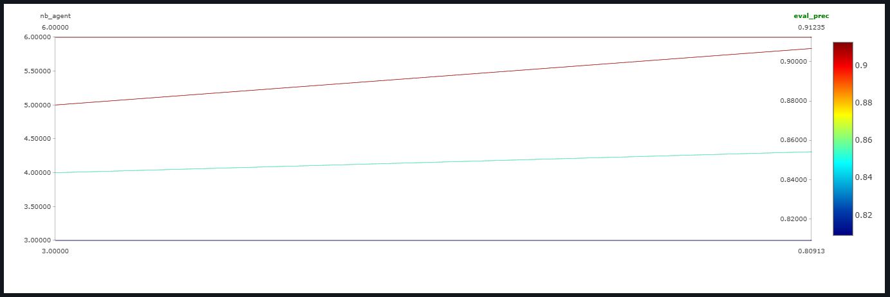
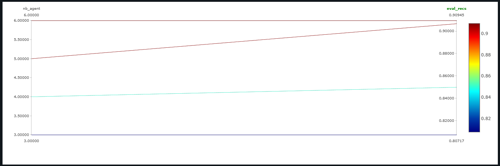
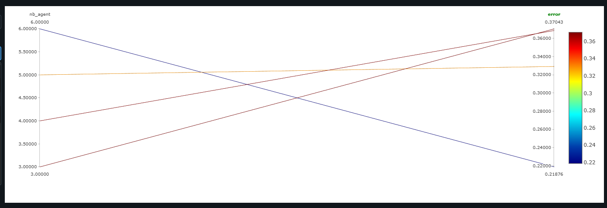

# Baseline Experiment Documentation

## Experiment Overview

- **Experiment Name:**  
    Effect of the Number of Agents on Performance

- **Date:**  
  *[30/10/2024]*

- **Objective:**  
  To evaluate the impact of varying the number of agents (4, 5, and 6) on the performance of a multi-agent reinforcement learning (MARL) classification model.  

---

## Experimental Setup

### Hyperparameters

| Hyperparameter | Value                           | Description                                                          |
| -------------- | ------------------------------- | -------------------------------------------------------------------- |
| `-a`           | `3`                             | *Number of agents.*                                                  |
| `--step`       | `5`                             | *Number of steps.*                                                   |
| `--action`     | `"[[1,0],[-1,0],[0,1],[0,-1]]"` | *Possible steps for each agent.*                                     |
| `--img-size`   | `28`                            | *Image Size.*                                                        |
| `--nb-class`   | `10`                            | *Number of possible classes in the dataset.*                         |
| `-d`           | `2`                             | *State dimension (e.g. 2D).*                                         |
| `--f`          | `6`                             | *Observation window size.*                                           |
| `--ft-extr`    | `mnist`                         | *Feature extractor (e.g. CNN for mnist).*                            |
| `--nb`         | `64`                            | *Hidden size for belief in Long Short-Term Memory (LSTM).*           |
| `--na`         | `64`                            | *Hidden size for Action in Long Short-Term Memory (LSTM).*           |
| `--nm`         | `16`                            | *Message size for Neural Networks.*                                  |
| `--nd`         | `8`                             | *State Hidden Size.*                                                 |
| `--nlb`        | `96`                            | *Network internal hidden size for linear projections (belief unit).* |
| `--nla`        | `96`                            | *Network internal hidden size for linear projections (action unit).* |
| `--batch-size` | `32`                            | *Batch Size.*                                                        |
| `--lr`         | `1e-3`                          | *This is the learning rate.*                                         |
| `--nb-epoch`   | `50`                            | *This is the number of Epochs.*                                      |


Running commands:

`4 agents`

```bash
python -m marl_classification -a 4 --step 5 --run-id train_mnist train --action "[[1,0],[-1,0],[0,1],[0,-1]]" --img-size 28 --nb-class 10 -d 2 --f 6 --ft-extr mnist --nb 64 --na 64 --nm 16 --nd 8 --nlb 96 --nla 96 --batch-size 32 --lr 1e-3 --nb-epoch 50 -o ./out/mnist_actor_critic
```

`5 agents`

```bash
python -m marl_classification -a 5 --step 5 --run-id train_mnist train --action "[[1,0],[-1,0],[0,1],[0,-1]]" --img-size 28 --nb-class 10 -d 2 --f 6 --ft-extr mnist --nb 64 --na 64 --nm 16 --nd 8 --nlb 96 --nla 96 --batch-size 32 --lr 1e-3 --nb-epoch 50 -o ./out/mnist_actor_critic
```
`6 agents`

```bash
python -m marl_classification -a 6 --step 5 --run-id train_mnist train --action "[[1,0],[-1,0],[0,1],[0,-1]]" --img-size 28 --nb-class 10 -d 2 --f 6 --ft-extr mnist --nb 64 --na 64 --nm 16 --nd 8 --nlb 96 --nla 96 --batch-size 32 --lr 1e-3 --nb-epoch 50 -o ./out/mnist_actor_critic
```


---

## Results

`4 agents`

```bash
Epoch 49 - Train, train_prec = 0.841, train_rec = 0.840, c_loss = 1.4154, a_loss = 1.3423, error = 0.4597, path = -0.9560: 
Epoch 49 - Eval, eval_prec = 0.8542, eval_rec = 0.8498:
```
`5 agents`

```bash
Epoch 49 - Train, train_prec = 0.895, train_rec = 0.895, c_loss = 1.3906, a_loss = 0.6409, error = 0.3153, path = -0.9354: 
Epoch 49 - Eval, eval_prec = 0.9067, eval_rec = 0.9067: 
```

`6 agents`

```bash
Epoch 49 - Train, train_prec = 0.908, train_rec = 0.908, c_loss = 1.3381, a_loss = 0.4259, error = 0.2683, path = -0.9155: 
Epoch 49 - Eval, eval_prec = 0.9123, eval_rec = 0.9094: 
```
### Key Metrics

| **Metric**          | **4 Agents** | **5 Agents** | **6 Agents** |
|---------------------|--------------|--------------|--------------|
| **Train Precision** | 0.841        | 0.895        | 0.908        |
| **Train Recall**    | 0.840        | 0.895        | 0.908        |
| **Train Error**     | 0.4597       | 0.3153       | 0.2683       |
| **Eval Precision**  | 0.8542       | 0.9067       | 0.9123       |
| **Eval Recall**     | 0.8498       | 0.9067       | 0.9094       |
| **Critic Loss**     | 1.4154       | 1.3906       | 1.3381       |
| **Actor Loss**      | 1.3423       | 0.6409       | 0.4259       |

### 1. Performance Summary

- **Best Episode:**  
  *The best performance across different agent configurations was achieved with 6 agents. In the final training epoch, the model reached a precision and recall of 0.9123 and 0.9094, respectively, during evaluation.*

- **Average Reward:**  
  *we observed a progressive decrease in error and increase in accuracy as the number of agents increased. This suggests that adding agents improves final accuracy.*

- **Convergence:**  
  *The model showed signs of convergence, especially with a higher number of agents, consistently reducing the error and enhancing performance.*

### 3. Graphs and Plots

| **Figure**                    | **Description**                         |
|-------------------------------|-----------------------------------------|
|  | *`eval_prec` vs ` Number of Agents`*  |
|                               |                                         |
|  |  *`eval_recs` vs ` Number of Agents`*   |
|                                |                                         |
|  |   *`error` vs ` Number of Agents`*|    
---

## Discussion

### 1. Key Observations

- Increasing the number of agents (2 to 6) led to a consistent improvement in model accuracy and a reduction in error rates,
- indicating that a higher agent count enhances the model's ability to classify images more effectively.

### 2. Issues Encountered

- Computational overhead grows with the number of agents, potentially limiting scalability in real-world applications.
- Further investigation is needed to determine if the trend holds for significantly larger numbers of agents. 

### 3. Future Improvements
- carry out other experiments with more agents

---

## Conclusion

- *This experiment validated the hypothesis that increasing the number of agents enhances classification accuracy and reduces errors. The results highlight the value of collaboration among agents in decentralized learning tasks, especially for challenging environments like image classification. However, careful consideration of computational trade-offs is necessary for scaling beyond six agents.*


## Appendix

### 1. Code

- Results could be replicated on the following commit:
```bash
git checkout e3d230024e175aa19f8f6e635a4b6fc7d569270b
```