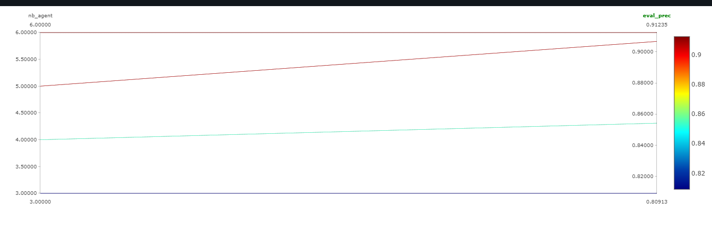

# Baseline Experiment Documentation

## Experiment Overview

- **Experiment Name:**  
    effect of the number of agents on the results obtained
- **Date:**  
  *[30/10/2024]*

---

## Experimental Setup

### Hyperparameters

| Hyperparameter | Value                           | Description                                                          |
| -------------- | ------------------------------- | -------------------------------------------------------------------- |
| `-a`           | `3`                             | *Number of agents.*                                                  |
| `--step`       | `5`                             | *Number of steps.*                                                   |
| `--action`     | `"[[1,0],[-1,0],[0,1],[0,-1]]"` | *Possible steps for each agent.*                                     |
| `--img-size`   | `28`                            | *Image Size.*                                                        |
| `--nb-class`   | `10`                            | *Number of possible classes in the dataset.*                         |
| `-d`           | `2`                             | *State dimension (e.g. 2D).*                                         |
| `--f`          | `6`                             | *Observation window size.*                                           |
| `--ft-extr`    | `mnist`                         | *Feature extractor (e.g. CNN for mnist).*                            |
| `--nb`         | `64`                            | *Hidden size for belief in Long Short-Term Memory (LSTM).*           |
| `--na`         | `64`                            | *Hidden size for Action in Long Short-Term Memory (LSTM).*           |
| `--nm`         | `16`                            | *Message size for Neural Networks.*                                  |
| `--nd`         | `8`                             | *State Hidden Size.*                                                 |
| `--nlb`        | `96`                            | *Network internal hidden size for linear projections (belief unit).* |
| `--nla`        | `96`                            | *Network internal hidden size for linear projections (action unit).* |
| `--batch-size` | `32`                            | *Batch Size.*                                                        |
| `--lr`         | `1e-3`                          | *This is the learning rate.*                                         |
| `--nb-epoch`   | `50`                            | *This is the number of Epochs.*                                      |


Running commands:

`4 agents`

```bash
python -m marl_classification -a 4 --step 5 --run-id train_mnist train --action "[[1,0],[-1,0],[0,1],[0,-1]]" --img-size 28 --nb-class 10 -d 2 --f 6 --ft-extr mnist --nb 64 --na 64 --nm 16 --nd 8 --nlb 96 --nla 96 --batch-size 32 --lr 1e-3 --nb-epoch 50 -o ./out/mnist_actor_critic
```

`5 agents`

```bash
python -m marl_classification -a 5 --step 5 --run-id train_mnist train --action "[[1,0],[-1,0],[0,1],[0,-1]]" --img-size 28 --nb-class 10 -d 2 --f 6 --ft-extr mnist --nb 64 --na 64 --nm 16 --nd 8 --nlb 96 --nla 96 --batch-size 32 --lr 1e-3 --nb-epoch 50 -o ./out/mnist_actor_critic
```
`6 agents`

```bash
python -m marl_classification -a 6 --step 5 --run-id train_mnist train --action "[[1,0],[-1,0],[0,1],[0,-1]]" --img-size 28 --nb-class 10 -d 2 --f 6 --ft-extr mnist --nb 64 --na 64 --nm 16 --nd 8 --nlb 96 --nla 96 --batch-size 32 --lr 1e-3 --nb-epoch 50 -o ./out/mnist_actor_critic
```


---

## Results

`4 agents`

```bash
Epoch 49 - Train, train_prec = 0.841, train_rec = 0.840, c_loss = 1.4154, a_loss = 1.3423, error = 0.4597, path = -0.9560: 
Epoch 49 - Eval, eval_prec = 0.8542, eval_rec = 0.8498:
```
`5 agents`

```bash
Epoch 49 - Train, train_prec = 0.895, train_rec = 0.895, c_loss = 1.3906, a_loss = 0.6409, error = 0.3153, path = -0.9354: 
Epoch 49 - Eval, eval_prec = 0.9067, eval_rec = 0.9067: 
```

`6 agents`

```bash
Epoch 49 - Train, train_prec = 0.908, train_rec = 0.908, c_loss = 1.3381, a_loss = 0.4259, error = 0.2683, path = -0.9155: 
Epoch 49 - Eval, eval_prec = 0.9123, eval_rec = 0.9094: 
```

### 1. Performance Summary

- **Best Episode:**  
  *The best performance across different agent configurations was achieved with 6 agents. In the final training epoch, the model reached a precision and recall of 0.9123 and 0.9094, respectively, during evaluation.*

- **Average Reward:**  
  *we observed a progressive decrease in error and increase in accuracy as the number of agents increased. This suggests that adding agents improves final accuracy.*

- **Convergence:**  
  *The model showed signs of convergence, especially with a higher number of agents, consistently reducing the error and enhancing performance.*

### 3. Graphs and Plots



---

## Discussion

### 1. Key Observations

Increasing the number of agents (4 to 6) led to a consistent improvement in model accuracy and a reduction in error rates,
 indicating that a higher agent count enhances the model's ability to classify images more effectively.

### 2. Issues Encountered

- Message Reciver is not applied to the model.

### 3. Future Improvements
NA

---

## Conclusion

- *This experiment demonstrated that increasing the number of agents significantly improves classification accuracy and reduces error rates,confirming the value of a multi-agent approach in decentralized image classification.*


## Appendix

### 1. Code

- Results could be replicated on the following commit:
```bash
git checkout 4d924926e9fc1a05a4457fc905ed4018b554aa87
```