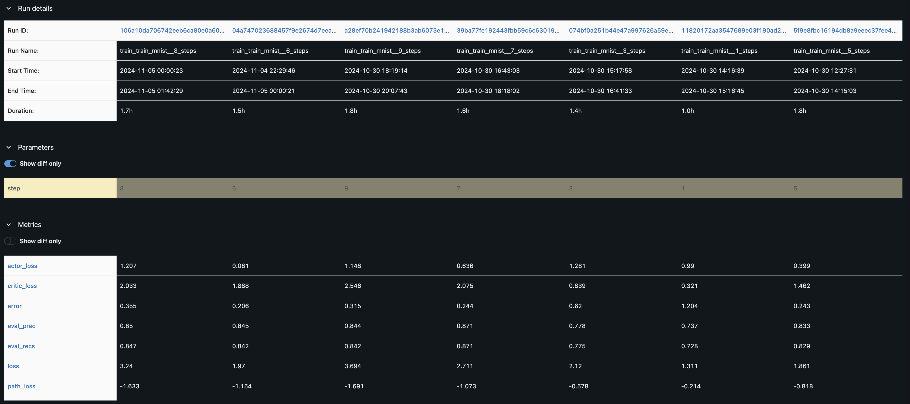
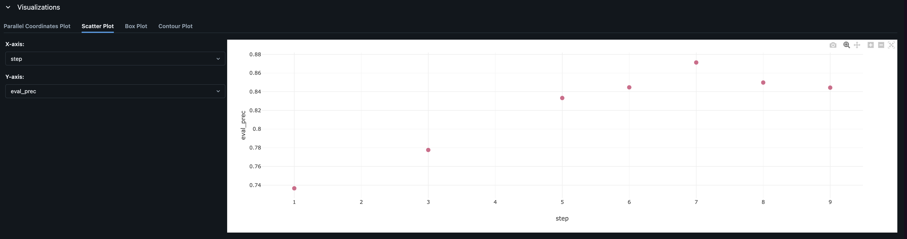
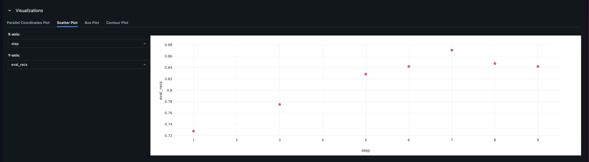

# MARL Experiment Documentation

## Experiment Overview

- **Experiment Name:**  Number of Steps Experiment

This experiment aims to evaluate the performance of the MARL model with within this range [1,3,5,6,7,8,9]. The model is trained for 40 epochs with a batch size of 32 and a learning rate of 1e-3.
  

- **Date:**  *07/11//2024*

- **What changed from Base Experiment:**
  The only changes introduced in this experiment are the number of steps that the agents can take. The number of steps is varied within this range [1,3,5,6,7,8,9]. everything else remains the same.

---

## Experimental Setup

### 1. Hyperparameters

| Hyperparameter | Value                           | Description                                                          |
| -------------- | ------------------------------- | -------------------------------------------------------------------- |
| `-a`           | `3`                             | *Number of agents.*                                                  |
| `--step`       | `5`                             | *Number of steps.*                                                   |
| `--action`     | `"[[1,0],[-1,0],[0,1],[0,-1]]"` | *Possible steps for each agent.*                                     |
| `--img-size`   | `28`                            | *Image Size.*                                                        |
| `--nb-class`   | `10`                            | *Number of possible classes in the dataset.*                         |
| `-d`           | `2`                             | *State dimension (e.g. 2D).*                                         |
| `--f`          | `6`                             | *Observation window size.*                                           |
| `--ft-extr`    | `mnist`                         | *Feature extractor (e.g. CNN for mnist).*                            |
| `--nb`         | `64`                            | *Hidden size for belief in Long Short-Term Memory (LSTM).*           |
| `--na`         | `64`                            | *Hidden size for Action in Long Short-Term Memory (LSTM).*           |
| `--nm`         | `16`                            | *Message size for Neural Networks.*                                  |
| `--nd`         | `8`                             | *State Hidden Size.*                                                 |
| `--nlb`        | `96`                            | *Network internal hidden size for linear projections (belief unit).* |
| `--nla`        | `96`                            | *Network internal hidden size for linear projections (action unit).* |
| `--batch-size` | `32`                            | *Batch Size.*                                                        |
| `--lr`         | `1e-3`                          | *This is the learning rate.*                                         |
| `--nb-epoch`   | `50`                            | *This is the number of Epochs.*                                      |

Running command:
1 step
```bash
python -m marl_classification -a 3 --step 1 --run-id train_mnist__1_steps train --action "[[1,0],[-1,0],[0,1],[0,-1]]" --img-size 28 --nb-class 10 -d 2 --f 6 --ft-extr mnist --nb 64 --na 64 --nm 16 --nd 8 --nlb 96 --nla 96 --batch-size 32 --lr 1e-3 --nb-epoch 40 -o ./out/mnist_actor_critic
```


3 steps 
```bash
python -m marl_classification -a 3 --step 3 --run-id train_mnist__3_steps train --action "[[1,0],[-1,0],[0,1],[0,-1]]" --img-size 28 --nb-class 10 -d 2 --f 6 --ft-extr mnist --nb 64 --na 64 --nm 16 --nd 8 --nlb 96 --nla 96 --batch-size 32 --lr 1e-3 --nb-epoch 40 -o ./out/mnist_actor_critic
```

5 steps 
```bash
python -m marl_classification -a 3 --step 5 --run-id train_mnist__5_steps train --action "[[1,0],[-1,0],[0,1],[0,-1]]" --img-size 28 --nb-class 10 -d 2 --f 6 --ft-extr mnist --nb 64 --na 64 --nm 16 --nd 8 --nlb 96 --nla 96 --batch-size 32 --lr 1e-3 --nb-epoch 40 -o ./out/mnist_actor_critic
```

7 steps 
```bash
python -m marl_classification -a 3 --step 7 --run-id train_mnist__7_steps train --action "[[1,0],[-1,0],[0,1],[0,-1]]" --img-size 28 --nb-class 10 -d 2 --f 6 --ft-extr mnist --nb 64 --na 64 --nm 16 --nd 8 --nlb 96 --nla 96 --batch-size 32 --lr 1e-3 --nb-epoch 40 -o ./out/mnist_actor_critic
```

9 steps 
```bash
python -m marl_classification -a 3 --step 9 --run-id train_mnist__9_steps train --action "[[1,0],[-1,0],[0,1],[0,-1]]" --img-size 28 --nb-class 10 -d 2 --f 6 --ft-extr mnist --nb 64 --na 64 --nm 16 --nd 8 --nlb 96 --nla 96 --batch-size 32 --lr 1e-3 --nb-epoch 40 -o ./out/mnist_actor_critic
```


---

## Results

### 1. Performance Summary

|  |
| :-----------------------------------------------------------------------------------------------------------: |
|           *This table shows the performance summary for different number of steps [1,3,5,6,7,8,9].*           |


### 3. Graphs and Plots

|                                                                                              |
| :----------------------------------------------------------------------------------------------------------------------------------------------------------------------------------------: |
| *This figure shows the evaluation precision for different number of steps [1,3,5,6,7,8,9]. Step 1 and 3 has the lowest percentage, while step 7 has the highest percentage arround 0.87%.* |


|                                                                                            |
| :-------------------------------------------------------------------------------------------------------------------------------------------------------------------------------------: |
| *This figure shows the evaluation recall for different number of steps [1,3,5,6,7,8,9]. Step 1 and 3 has the lowest percentage, while step 7 has the highest percentage arround 0.87%.* |


---

## Discussion

### 1. Key Observations

- Using low number of steps (1 and 3) results in lower evaluation precision and recall, which is expected as the agents would not have enough steps to explore the environment (ie the image).
- As we increase the number of steps from 5 to 7, the evaluation precision and recall increase, with step 7 having the highest values.
- The evaluation precision and recall decrease when the number of steps is increased to 9. This could be due to the agents having observation window of 6x6, it could cause the agent to take unnecessary steps that do not contribute to the classification task.

### 2. Issues Encountered

- No major issues were encountered during the experiment, however as number of steps increases, the model might require more computational resources.

### 3. Future Improvements

- Going forward, it would be interesting to investigate the impact of increasing the observation window size on the model's performance, while changing the number of steps.

---

## Conclusion

The results of this experiment show that the number of steps taken by the agents has a significant impact on the model's performance. In this experiment, we observed that using 7 steps resulted in the highest evaluation precision and recall. This suggests that the agents need a sufficient number of steps to explore the environment and make informed decisions and contribute to the classification task.