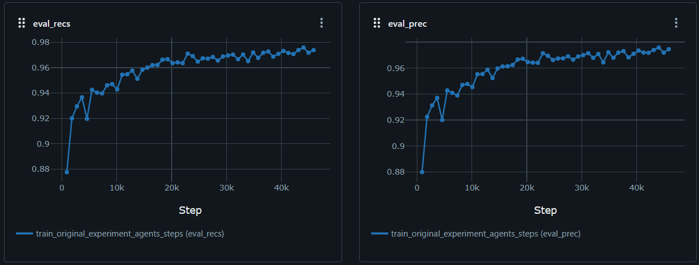

# MARL Experiment Documentation

## Experiment Overview

- **Max Steps and Epochs Experiment:**  
  *Test the best possible outcome with the message module fully implemented.*

- **Date:**  
  *[05/11/2024]*

- **What changed from Original Experiment:**
  *The hidden size, message size and batch size were changed to meet with the values used in the paper, as in the number of neurons experiment. Also, the number of agents, steps and field of view were increased to the maximum used in the paper, in order to test whether this implementation allows as good results as the paper, in its most extreme conditions.*

---

## Experimental Setup

### 1. Hyperparameters

| Hyperparameter | Value                           | Description                                                          |
| -------------- | ------------------------------- | -------------------------------------------------------------------- |
| `-a`           | `6`                             | *Number of agents.*                                                  |
| `--step`       | `9`                             | *Number of steps.*                                                   |
| `--action`     | `"[[1,0],[-1,0],[0,1],[0,-1]]"` | *Possible steps for each agent.*                                     |
| `--img-size`   | `28`                            | *Image Size.*                                                        |
| `--nb-class`   | `10`                            | *Number of possible classes in the dataset.*                         |
| `-d`           | `2`                             | *State dimension (e.g. 2D).*                                         |
| `--f`          | `8`                             | *Observation window size.*                                           |
| `--ft-extr`    | `mnist`                         | *Feature extractor (e.g. CNN for mnist).*                            |
| `--nb`         | `64`                            | *Hidden size for belief in Long Short-Term Memory (LSTM).*           |
| `--na`         | `64`                            | *Hidden size for Action in Long Short-Term Memory (LSTM).*           |
| `--nm`         | `12`                            | *Message size for Neural Networks.*                                  |
| `--nd`         | `8`                             | *State Hidden Size.*                                                 |
| `--nlb`        | `64`                            | *Network internal hidden size for linear projections (belief unit).* |
| `--nla`        | `64`                            | *Network internal hidden size for linear projections (action unit).* |
| `--batch-size` | `64`                            | *Batch Size.*                                                        |
| `--lr`         | `1e-3`                          | *This is the learning rate.*                                         |
| `--nb-epoch`   | `50`                            | *This is the number of Epochs.*                                      |

Running command:
```bash
python -m marl_classification -a 6 --step 9 --run-id original_experiment train --action "[[1,0],[-1,0],[0,1],[0,-1]]" --img-size 28 --nb-class 10 -d 2 --f 8 --ft-extr mnist --nb 64 --na 64 --nm 12 --nd 64 --nlb 64 --nla 64 --batch-size 64 --lr 1e-3 --nb-epoch 50 -o ./out/mnist_original
```

---

## Results

```bash
Epoch 49 - Train, train_prec = 0.9826, train_rec = 0.9828, c_loss = 2.758, a_loss = -2.1103, error = 0.0955, path = -2.9694:
Epoch 49 - Eval, eval_prec = 0.9744, eval_rec = 0.9739

```

### 3. Graphs and Plots



---

## Discussion

### 1. Key Observations

- *The values the model attained with the selected parameters turned out to be almost perfect, attaining what the best precision expected for the MNIST dataset, without overfitting.*

### 2. Issues Encountered

- *Training time is more than the double than the previous examples, since the hyperparameters that require most computacional power were increased. It took 4.4h to train while with othere hyperparameters it took 1.8h.*

### 3. Future Improvements

- *Improving this model's precision would probably lead to overfitting. The only possible improvement is to obtain such results with less computacional burden.*

---

## Conclusion

- *Despite the computational burden required to train this model, the best possible outcome for this dataset was attained. The precision can not be further improved and only changes to improve its efficiency should be made.*

---