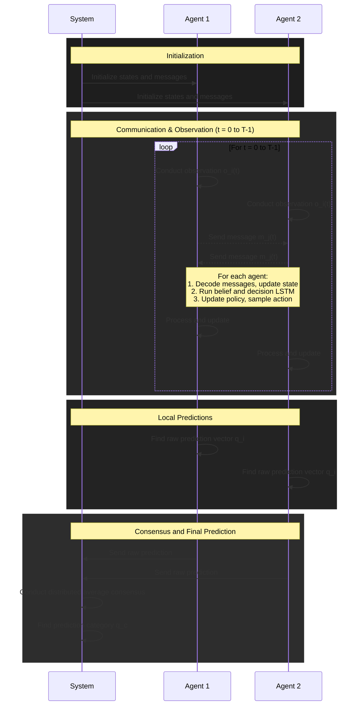

```mermaid
sequenceDiagram
    participant S as System
    participant A as Agent 1
    participant B as Agent 2

    rect rgb(30, 30, 30)
        Note over S,B: Initialization
        S->>A: Initialize states and messages
        S->>B: Initialize states and messages
    end

    rect rgb(40, 40, 40)
        Note over S,B: Communication & Observation (t = 0 to T-1)
        loop For t = 0 to T-1
            A->>A: Conduct observation o_i(t)
            B->>B: Conduct observation o_i(t)

            A-->>B: Send message m_j(t)
            B-->>A: Send message m_j(t)

            Note over A,B: For each agent:<br/>1. Decode messages, update state<br/>2. Run belief and decision LSTM<br/>3. Update policy, sample action
            A->>A: Process and update
            B->>B: Process and update
        end
    end

    rect rgb(35, 35, 35)
        Note over S,B: Local Predictions
        A->>A: Find raw prediction vector q_i
        B->>B: Find raw prediction vector q_i
    end

    rect rgb(45, 45, 45)
        Note over S,B: Consensus and Final Prediction
        A->>S: Send raw prediction
        B->>S: Send raw prediction
        S->>S: Conduct distributed average consensus
        S->>S: Find prediction category q_c
    end
```
